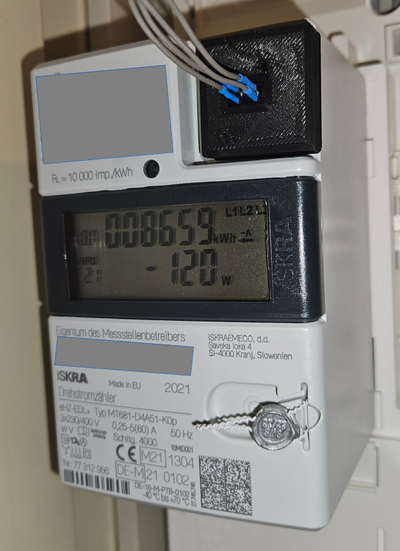
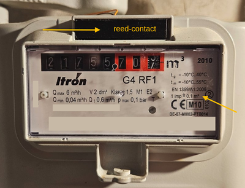
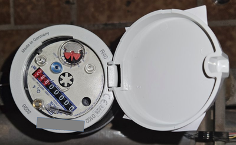
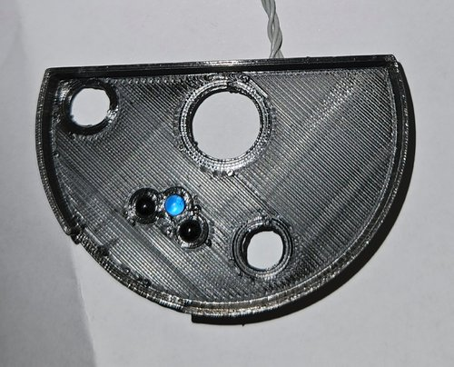
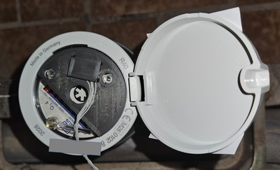

<u>Electricity Meter:</u>

An ISKRA MT681 meter, equipped with the Smart Meter Language (SML)
protocol, is used to measure electricity. The meter outputs data such as
total power consumption, instantaneous power, and other values.
Communication takes place via an infrared LED at a baud rate of 9600.

The signal is captured by an IR-diode and fed to the ESP32 via a UART
interface. A 10k-ohm pull-up resistor stabilizes the ESP32\'s Rx input.

Gas Meter:

Gas volume is measured using an \"Itron G4 RF1\" model. The gas meter
emits a pulse every 0.1 m³ via an internally installed magnet. This
pulse can be detected using a reed contact with a low operate value
(AW).

Unfortunately, the mounting location for the reed contact varies
depending on the gas meter model. On the Itron gas meter, the mounting
point is located centrally above the register. The reed contact is
connected directly to a binary input on the ESP32, using a pull-up
resistor.

Water Meter:

Unfortunately, the water meter does not provide serial or binary
measurement output. For this reason, I developed a two-stage IR light
barrier system that determines the rotational speed and direction of the
pointer (a semi-circular metal plate).

The two IR diodes detect the reflected LED light with a time offset. A
full signal sequence is required to register a water flow of one liter.
The use of two IR diodes prevents unwanted signal bouncing (e.g., if the
metal plate happens to stop between the LED and the IR diode).

The data from the various meters is processed within the specific
libraries: \"watermanager,\" \"gasmanager,\" and \"smlmanager\".

\"mqttmanager\", \"ethmanager\", and \"webmanager\" handle
communication.

\"timemanager\" is responsible for determining hourly and daily values.
